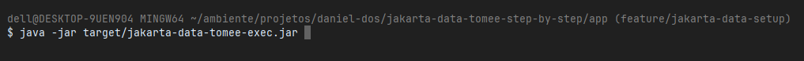
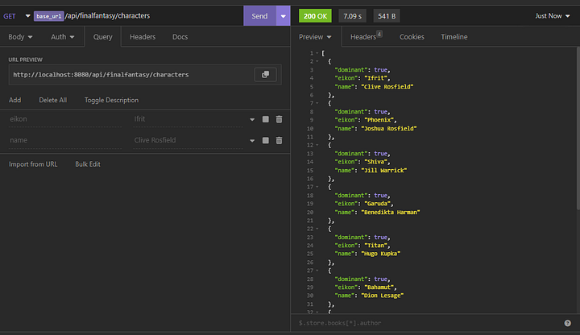
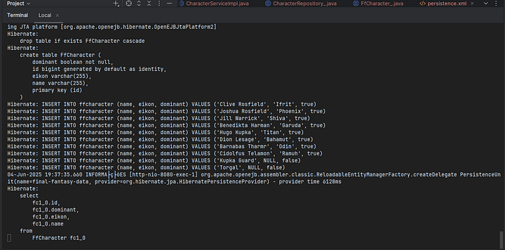

This post we go create a simple Rest application with Apache Tomee and Jakarta Data to simplify our data persistence without having to write several lines of code for common operations like CRUD.

<!-- truncate -->

For this we will create 2 simple endpoints (get/post) using the following libs and resources:

- [H2-DataBase](http://www.h2database.com/html/main.html)
- [Apache TomEE](https://tomee.apache.org/)
- [Jakarta Data](https://jakarta.ee/specifications/data/1.0/jakarta-data-1.0)
- [Hibernate](https://docs.jboss.org/hibernate/orm/6.6/repositories/html_single/Hibernate_Data_Repositories.html)

### Introduction at Apache TomEE

TomEE is an Application Server open source, based in Apache TomCat, but with Jakarta EE features. Is an alternative at TomCat, that offers support to many of Java Enterprise Specifications.

In your version current 10.0.1 offers support to Jakarta EE 10 ,MicroProfile 6.0 using [Smallrye](https://smallrye.io/) in your implementations and run with Java 17 or higher.

### Introduction at Jakarta Data

Jakarta Data is new Specification to Jakarta EE to allowing applications have an easy access to data technologies such as relational and non-relational databases.

Similar the others frameworks/lib , how Spring Data or Apache Deltaspike(my Favorite🤓).

---

### Creating your Maven Project

First, create a new project maven with the following dependencies:
```xml
<project xmlns="http://maven.apache.org/POM/4.0.0"
         xmlns:xsi="http://www.w3.org/2001/XMLSchema-instance"
         xsi:schemaLocation="http://maven.apache.org/POM/4.0.0
                             http://maven.apache.org/xsd/maven-4.0.0.xsd">

    <modelVersion>4.0.0</modelVexmlrsion>
    <groupId>com.medium.danieldiasjava</groupId>
    <artifactId>jakarta-data-tomee-step-by-step</artifactId>
    <version>1.0-SNAPSHOT</version>
    <packaging>war</packaging>

    <name>Jakarta Data with TomEE - Step by Step</name>

    <properties>
        <java.version>23</java.version>
        <maven.compiler.target>${java.version}</maven.compiler.target>
        <failOnMissingWebXml>false</failOnMissingWebXml>
        <maven.compiler.source>${java.version}</maven.compiler.source>
        <project.build.sourceEncoding>UTF-8</project.build.sourceEncoding>
        <project.reporting.outputEncoding>UTF-8</project.reporting.outputEncoding>
        <tomee.version>10.0.1</tomee.version>
        <jakarta.data.version>1.0.1</jakarta.data.version>
        <hibernate.version>6.6.15.Final</hibernate.version>
        <hibernate.jpamodelgen.version>6.5.0.Final</hibernate.jpamodelgen.version>
        <h2.version>2.3.232</h2.version>
        <jakarta.jakartaee-web-api.version>10.0.0</jakarta.jakartaee-web-api.version>
        <microprofile.version>6.0</microprofile.version>
    </properties>

    <dependencies>
        <dependency>
            <groupId>jakarta.platform</groupId>
            <artifactId>jakarta.jakartaee-web-api</artifactId>
            <version>${jakarta.jakartaee-web-api.version}</version>
            <scope>provided</scope>
        </dependency>

        <dependency>
            <groupId>org.eclipse.microprofile</groupId>
            <artifactId>microprofile</artifactId>
            <version>${microprofile.version}</version>
            <type>pom</type>
            <scope>provided</scope>
        </dependency>

        <dependency>
            <groupId>jakarta.data</groupId>
            <artifactId>jakarta.data-api</artifactId>
            <version>${jakarta.data.version}</version>
        </dependency>

        <dependency>
            <groupId>org.hibernate.orm</groupId>
            <artifactId>hibernate-core</artifactId>
            <version>${hibernate.version}</version>
        </dependency>

        <dependency>
            <groupId>com.h2database</groupId>
            <artifactId>h2</artifactId>
            <version>${h2.version}</version>
            <scope>runtime</scope>
        </dependency>
    </dependencies>

    <build>
        <finalName>jakarta-data-tomee</finalName>
        <plugins>
            <plugin>
                <groupId>org.apache.maven.plugins</groupId>
                <artifactId>maven-war-plugin</artifactId>
                <version>3.3.1</version>
                <configuration>
                    <failOnMissingWebXml>false</failOnMissingWebXml>
                </configuration>
            </plugin>
            <plugin>
                <groupId>org.apache.maven.plugins</groupId>
                <artifactId>maven-compiler-plugin</artifactId>
                <version>3.8.1</version>
                <configuration>
                    <source>${java.version}</source>
                    <target>${java.version}</target>
                    <annotationProcessorPaths>
                        <path>
                            <groupId>org.hibernate.orm</groupId>
                            <artifactId>hibernate-jpamodelgen</artifactId>
                            <version>${hibernate.jpamodelgen.version}</version>
                        </path>
                    </annotationProcessorPaths>
                </configuration>
            </plugin>
            <plugin>
                <groupId>org.apache.tomee.maven</groupId>
                <artifactId>tomee-maven-plugin</artifactId>
                <version>${tomee.version}</version>
                <executions>
                    <execution>
                        <id>executable-jar</id>
                        <phase>package</phase>
                        <goals>
                            <goal>exec</goal>
                        </goals>
                    </execution>
                </executions>
                <configuration>
                    <context>ROOT</context>
                    <tomeeHttpPort>8080</tomeeHttpPort>
                    <tomeeShutdownPort>8005</tomeeShutdownPort>
                    <tomeeAjpPort>8009</tomeeAjpPort>
                    <tomeeVersion>${tomee.version}</tomeeVersion>
                    <tomeeArtifactId>apache-tomee</tomeeArtifactId>
                    <tomeeGroupId>org.apache.tomee</tomeeGroupId>
                    <tomeeClassifier>microprofile</tomeeClassifier>
                    <libs>
                        <lib>remove:openjpa</lib>
                    </libs>
                </configuration>
            </plugin>
        </plugins>
    </build>

</project>

```

Here are the basic dependencies for the TomEE and Jakarta Data working:

- [jakarta.data-api](https://mvnrepository.com/artifact/jakarta.data/jakarta.data-api/1.0.1)
- [hibernate-core](https://mvnrepository.com/artifact/org.hibernate.orm/hibernate-core/6.6.15.Final)
- [hibernate-jpamodelgen](https://mvnrepository.com/artifact/org.hibernate.orm/hibernate-jpamodelgen/6.6.15.Final)

Basically, that’s all for to work well 😃.

---

### Creating the Classes

Now we will create a class Model with name FfCharacter, very simple with annotation de JPA:

```java
package com.medium.danieldiasjava.model.entity;

import jakarta.persistence.Entity;
import jakarta.persistence.GeneratedValue;
import jakarta.persistence.GenerationType;
import jakarta.persistence.Id;

@Entity
public class FfCharacter{
    @Id
    @GeneratedValue(strategy = GenerationType.IDENTITY)
    private Long id;

    private String name;
    private String eikon;
    private boolean dominant;

    public FfCharacter() {
    }

    public FfCharacter(String name, String eikon, boolean dominant) {
        this.name = name;
        this.eikon = eikon;
        this.dominant = dominant;
    }

    public Long getId() {
        return id;
    }

    public void setId(Long id) {
        this.id = id;
    }

    public String getName() {
        return name;
    }

    public void setName(String name) {
        this.name = name;
    }

    public String getEikon() {
        return eikon;
    }

    public void setEikon(String eikon) {
        this.eikon = eikon;
    }

    public boolean isDominant() {
        return dominant;
    }

    public void setDominant(boolean dominant) {
        this.dominant = dominant;
    }
}
```

yes, I’m a big fan of Final Fantasy 🤓.

The next step is to create a Interface Repository for starting the use of Jakarta-Data:

```java
package com.medium.danieldiasjava.repository;

import com.medium.danieldiasjava.model.entity.FfCharacter;
import jakarta.data.repository.Find;
import jakarta.data.repository.Insert;
import jakarta.data.repository.Query;
import jakarta.data.repository.Repository;

import java.util.List;

@Repository
public interface CharacterRepository {

    @Find
    FfCharacter findCharacterByName(String name);

    @Query("where eikon = ?1")
    FfCharacter characterByEikon(String eikon);

    @Find
     List<FfCharacter> findCharacters();

    @Insert
     void saveCharacter(FfCharacter character);

}
```

This interface is all we need to work using Jakarta Data.

Note that it is very similar to what we use in Spring Data.

The difference is that we are not using an ***extends Crud, JPA or anything***.

Although it is possible to use it in Jakarta Data, there is not much need for it.

In addition, it also uses annotations for the operations of ***saving, searching*** and making a ***custom query***.

Now we will create a class Service that use our ***CharacterRepository***:

```java
package com.medium.danieldiasjava.service.impl;

import com.medium.danieldiasjava.model.entity.dto.CharacterDto;
import com.medium.danieldiasjava.repository.CharacterRepository;
import com.medium.danieldiasjava.service.CharacterService;
import jakarta.enterprise.context.RequestScoped;
import jakarta.inject.Inject;

import java.util.List;
import java.util.Objects;

@RequestScoped
public class CharacterServiceImpl implements CharacterService {

    private CharacterRepository characterRepository;

    public CharacterServiceImpl(){}

    @Inject
    public CharacterServiceImpl(CharacterRepository characterRepository) {
        this.characterRepository = characterRepository;
    }

    @Override
    public List<CharacterDto> getCharacters() {
        var characters = characterRepository.findCharacters();
        if (Objects.nonNull(characters) && !characters.isEmpty()) {
            return CharacterDto.EntityListFromDtoList(characters);
        }
        return List.of();
    }

    @Override
    public CharacterDto getCharacter(String name) {
        if (Objects.nonNull(name) && !name.isEmpty()) {
            var character = characterRepository.findCharacterByName(name);
            if (character != null) {
                return CharacterDto.EntityFromDto(character);
            }
        }
        return new CharacterDto("","", false);
    }

    @Override
    public CharacterDto getCharacterEikon(String eikon) {
        if (Objects.nonNull(eikon) && !eikon.isEmpty()) {
            var character = characterRepository.characterByEikon(eikon);
            if (character != null) {
                return CharacterDto.EntityFromDto(character);
            }
        }
        return new CharacterDto("","", false);
    }

    @Override
    public void saveCharacter(CharacterDto character) {
        if (Objects.nonNull(character)) {
            characterRepository.saveCharacter(
                    CharacterDto.dtoFromEntity(character)
            );
        } else {
            throw new IllegalArgumentException("Character cannot be null");
        }
    }
}
```

Basically we inject the ***CharacterRepository*** and call the corresponding methods of the interface operations.

Also note that at no point did we have to configure an ***EntityManager*** or anything similar to use the Data API. In addition, at no point did we implement the operations.

Remember that in the pom.xml, we added the ***hibernate-jpamodelgen*** dependency that is responsible for generating the code for implementing the repository that is identified as ***CharacterRepository_*** as well as the ***Entity class***:

```java
package com.medium.danieldiasjava.repository;

import com.medium.danieldiasjava.model.entity.FfCharacter;
import com.medium.danieldiasjava.model.entity.FfCharacter_;
import jakarta.annotation.Generated;
import jakarta.annotation.Nonnull;
import jakarta.annotation.PostConstruct;
import jakarta.annotation.PreDestroy;
import jakarta.data.exceptions.DataException;
import jakarta.data.exceptions.EmptyResultException;
import jakarta.data.exceptions.EntityExistsException;
import jakarta.enterprise.context.RequestScoped;
import jakarta.inject.Inject;
import jakarta.persistence.EntityManagerFactory;
import jakarta.persistence.NoResultException;
import jakarta.persistence.NonUniqueResultException;
import jakarta.persistence.PersistenceException;
import jakarta.persistence.PersistenceUnit;
import java.util.List;
import org.hibernate.SessionFactory;
import org.hibernate.StatelessSession;
import org.hibernate.exception.ConstraintViolationException;

@RequestScoped
@Generated("org.hibernate.processor.HibernateProcessor")
public class CharacterRepository_ implements CharacterRepository {

 static final String CHARACTER_BY_EIKON_String = "from FfCharacter where eikon = ?1";

 
 @Override
 public void saveCharacter(@Nonnull FfCharacter character) {
  if (character == null) throw new IllegalArgumentException("Null character");
  try {
   session.insert(character);
  }
  catch (ConstraintViolationException exception) {
   throw new EntityExistsException(exception.getMessage(), exception);
  }
  catch (PersistenceException exception) {
   throw new DataException(exception.getMessage(), exception);
  }
 }
 
 /**
  * Execute the query {@value #CHARACTER_BY_EIKON_String}.
  *
  * @see com.medium.danieldiasjava.repository.CharacterRepository#characterByEikon(String)
  **/
 @Override
 public FfCharacter characterByEikon(String eikon) {
  try {
   return session.createSelectionQuery(CHARACTER_BY_EIKON_String, FfCharacter.class)
    .setParameter(1, eikon)
    .getSingleResult();
  }
  catch (NoResultException exception) {
   throw new EmptyResultException(exception.getMessage(), exception);
  }
  catch (NonUniqueResultException exception) {
   throw new jakarta.data.exceptions.NonUniqueResultException(exception.getMessage(), exception);
  }
  catch (PersistenceException exception) {
   throw new DataException(exception.getMessage(), exception);
  }
 }
 
 protected @Nonnull StatelessSession session;
 
 public CharacterRepository_(@Nonnull StatelessSession session) {
  this.session = session;
 }
 
 public @Nonnull StatelessSession session() {
  return session;
 }
 
 /**
  * Find {@link FfCharacter} by {@link FfCharacter#name name}.
  *
  * @see com.medium.danieldiasjava.repository.CharacterRepository#findCharacterByName(String)
  **/
 @Override
 public FfCharacter findCharacterByName(String name) {
  var _builder = session.getFactory().getCriteriaBuilder();
  var _query = _builder.createQuery(FfCharacter.class);
  var _entity = _query.from(FfCharacter.class);
  _query.where(
    name==null
     ? _entity.get(FfCharacter_.name).isNull()
     : _builder.equal(_entity.get(FfCharacter_.name), name)
  );
  try {
   return session.createSelectionQuery(_query)
    .getSingleResult();
  }
  catch (NoResultException exception) {
   throw new EmptyResultException(exception.getMessage(), exception);
  }
  catch (NonUniqueResultException exception) {
   throw new jakarta.data.exceptions.NonUniqueResultException(exception.getMessage(), exception);
  }
  catch (PersistenceException exception) {
   throw new DataException(exception.getMessage(), exception);
  }
 }
 
 /**
  * Find {@link FfCharacter}.
  *
  * @see com.medium.danieldiasjava.repository.CharacterRepository#findCharacters()
  **/
 @Override
 public List<FfCharacter> findCharacters() {
  var _builder = session.getFactory().getCriteriaBuilder();
  var _query = _builder.createQuery(FfCharacter.class);
  var _entity = _query.from(FfCharacter.class);
  _query.where(
  );
  try {
   return session.createSelectionQuery(_query)
    .getResultList();
  }
  catch (PersistenceException exception) {
   throw new DataException(exception.getMessage(), exception);
  }
 }
 
 @PersistenceUnit
 private EntityManagerFactory sessionFactory;
 
 @PostConstruct
 private void openSession() {
  session = sessionFactory.unwrap(SessionFactory.class).openStatelessSession();
 }
 
 @PreDestroy
 private void closeSession() {
  session.close();
 }
 
 @Inject
 CharacterRepository_() {
 }

}

```

```java
package com.medium.danieldiasjava.model.entity;

import jakarta.annotation.Generated;
import jakarta.persistence.metamodel.EntityType;
import jakarta.persistence.metamodel.SingularAttribute;
import jakarta.persistence.metamodel.StaticMetamodel;

@StaticMetamodel(FfCharacter.class)
@Generated("org.hibernate.processor.HibernateProcessor")
public abstract class FfCharacter_ {

 public static final String DOMINANT = "dominant";
 public static final String EIKON = "eikon";
 public static final String NAME = "name";
 public static final String ID = "id";

 
 /**
  * @see com.medium.danieldiasjava.model.entity.FfCharacter#dominant
  **/
 public static volatile SingularAttribute<FfCharacter, Boolean> dominant;
 
 /**
  * @see com.medium.danieldiasjava.model.entity.FfCharacter#eikon
  **/
 public static volatile SingularAttribute<FfCharacter, String> eikon;
 
 /**
  * @see com.medium.danieldiasjava.model.entity.FfCharacter#name
  **/
 public static volatile SingularAttribute<FfCharacter, String> name;
 
 /**
  * @see com.medium.danieldiasjava.model.entity.FfCharacter#id
  **/
 public static volatile SingularAttribute<FfCharacter, Long> id;
 
 /**
  * @see com.medium.danieldiasjava.model.entity.FfCharacter
  **/
 public static volatile EntityType<FfCharacter> class_;

}
```

Furthermore Jakarta Data works with ***persistence.xml*** the way we currently use it, without changing anything in our experience:

```xml
<?xml version="1.0" encoding="UTF-8" standalone="yes"?>
<persistence xmlns="https://jakarta.ee/xml/ns/persistence"
             xmlns:xsi="http://www.w3.org/2001/XMLSchema-instance"
             xsi:schemaLocation="https://jakarta.ee/xml/ns/persistence
                                 https://jakarta.ee/xml/ns/persistence/persistence_3_1.xsd"
             version="3.1">

    <persistence-unit name="final-fantasy-data" transaction-type="RESOURCE_LOCAL">
        <provider>org.hibernate.jpa.HibernatePersistenceProvider</provider>
        <non-jta-data-source>final-fantasy-data</non-jta-data-source>
        <properties>
            <property name="jakarta.persistence.jdbc.driver" value="org.h2.Driver" />
            <property name="jakarta.persistence.validation.mode" value="none" />
            <property name="hibernate.hbm2ddl.auto" value="create-drop" />
            <property name="hibernate.show_sql" value="true" />
            <property name="tomee.jpa.factory.lazy" value="true" />
            <property name="hibernate.format_sql" value="true" />
            <property name="hibernate.dialect" value="org.hibernate.dialect.H2Dialect"/>
            <property name="jakarta.persistence.jdbc.user" value="sa" />
            <property name="jakarta.persistence.jdbc.password" value="" />
            <property name="jakarta.persistence.jdbc.url" value="jdbc:h2:mem:final-fantasy-data;DB_CLOSE_DELAY=-1;DB_CLOSE_ON_EXIT=FALSE"/>
            <property name="jakarta.persistence.sql-load-script-source" value="import.sql"/>
        </properties>
    </persistence-unit>
</persistence>
```

Now run the Project(github) ,open your Insomnia and test our application.








that’s all for today, I hope you enjoyed it.

***Code:***

(https://github.com/Daniel-Dos/jakarta-data-tomee-step-by-step)

#### References

- https://tomee.apache.org/
- https://docs.jboss.org/hibernate/orm/6.6/repositories/html_single/Hibernate_Data_Repositories.html
- https://jakarta.ee/specifications/data/1.0/jakarta-data-1.0