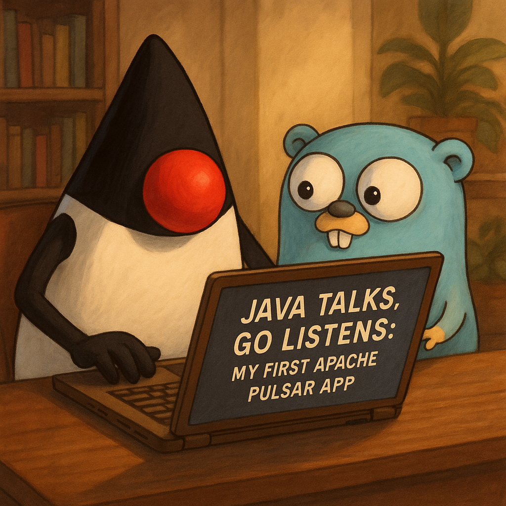

In this post, we will use Apache Pulsar to build a simple workflow: a Java Producer will send messages to a topic, and a Go Consumer will read and process those messages. 

This hands-on approach will help you understand the basics of how Pulsar works and how to integrate it into multi-language applications.

<!-- truncate -->

## Introduction at Apache Pulsar

Apache Pulsar is an open-source, cloud-native distributed messaging and streaming platform originally developed at Yahoo! in 2012 and donated to the Apache Software Foundation in 2016. It is designed to handle high-throughput, low-latency messaging while providing strong guarantees for message durability and delivery.

Unlike traditional message brokers, Pulsar separates compute (brokers) from storage (Apache BookKeeper). This unique architecture allows for:

- **Horizontal scalability** — the ability to add more brokers or storage nodes without downtime.
- **Infinite retention** — messages can be stored indefinitely and replayed by consumers at any time.
- **Tiered storage** — older messages can be offloaded to cheaper cloud storage solutions such as AWS S3, reducing on-premise storage costs.

### Key Features

- **Multi-tenancy**: Allows multiple teams or applications to securely share the same Pulsar cluster with strict isolation of namespaces and resources.
- **Durable message storage**: Uses Apache BookKeeper to persist messages reliably across multiple storage nodes with replication.
- **High performance**: Capable of handling millions of messages per second with millisecond latencies.
- **Flexible messaging models**: Supports publish-subscribe, shared subscriptions, exclusive subscriptions, failover, and key-shared subscriptions.
- **Geo-replication**: Automatically replicates messages across geographically distributed data centers for disaster recovery and global availability.
- **Schema Registry**: Provides schema enforcement and evolution to ensure data compatibility between producers and consumers.
- **Multi-language client support**: Official libraries are available for Java, Go, Python, C++, Node.js, and more.
- **Built-in Pulsar Functions**: Lightweight serverless functions for real-time data processing directly within the Pulsar ecosystem.
- **Cloud-native design**: Built to run smoothly on container orchestration platforms like Kubernetes.

### Architecture Overview

Apache Pulsar architecture consists mainly of three components:

- **Brokers**: Handle client connections, message routing, and subscription management.
- **BookKeeper Bookies**: Provide durable, replicated log storage for persistent message storage.
- **ZooKeeper**: Manages metadata, cluster coordination, and leader election.

This separation between brokers and storage enables independent scaling of compute and storage resources, leading to improved performance and elasticity.

### Why Choose Apache Pulsar?🤔

- **Scalability and elasticity**: Grow your infrastructure seamlessly without modifying applications.
- **Unified messaging and streaming**: Supports both traditional message queuing and real-time event streaming within a single platform.
- **Durability and reliability**: Guarantees message persistence and delivery even in failure scenarios.
- **Flexible deployment**: Runs efficiently on-premise, cloud, or hybrid environments.

### Typical Use Cases

- Real-time analytics  
- Event-driven microservices  
- IoT telemetry ingestion  
- Messaging queues  
- Multi-datacenter replication  

### Running Apache Pulsar with Docker Compose💻

This setup uses Docker Compose to run a full Pulsar environment with:

- pulsar: Pulsar standalone broker
- dashboard: Pulsar Manager UI on port 9527

<details>
  <summary>pulsar-compose.yaml</summary>

  ```yaml showLineNumbers
  version: "3"
services:
  pulsar:
    image: apachepulsar/pulsar:latest
    command: bin/pulsar standalone
    hostname: pulsar
    container_name: pulsar
    ports:
      - "8080:8080"
      - "6650:6650"
    environment:
      - PULSAR_PREFIX_brokerDeleteInactiveTopicsEnabled="false"
      - PULSAR_PREFIX_brokerDeleteInactiveTopicsFrequencySeconds="0"
    restart: always
    volumes:
      - "./data:/pulsar/data"
  dashboard:
    image: apachepulsar/pulsar-manager:latest
    ports:
      - "9527:9527"
      - "7750:7750"
    container_name: dashboard
    depends_on:
      - pulsar
    links:
      - pulsar
    environment:
      SPRING_CONFIGURATION_FILE: /pulsar-manager/pulsar-manager/application.properties
  ```

:::info

**`PULSAR_PREFIX_brokerDeleteInactiveTopicsEnabled="false"`** disables automatic deletion of inactive topics.

**`PULSAR_PREFIX_brokerDeleteInactiveTopicsFrequencySeconds="0"`** disables the periodic cleanup frequency.
:::
</details>

---

### Example Workflow

In this project, we demonstrate a simple Apache Pulsar workflow: a **Java Producer** sends messages to a topic, and a **Go Consumer** reads and processes those messages. This hands-on example helps you understand how Pulsar works and how to integrate it in multi-language environments.


---

## Java Producer: Sending Messages to Pulsar

:::warning
 The Java Producer application is designed to be deployed on **Apache TomEE**, a Jakarta EE certified application server.
:::

### Requirements

 - Java 23
 - Apache Maven

 ```
src/main/
├── java/com/medium/danieldiasjava/
│   ├── controller/
│   │   └── CharacterController.java
│   ├── model/entity/dto/
│   │   └── CharacterDto.java
│   ├── producer/
│   │   ├── LoggerProduce.java
│   │   └── PulsarClientProducerCDI.java
│   ├── pulsar/producer/
│   │   └── CharacterProducerEvent.java
│   ├── service/
│   │   ├── impl/
│   │   │   └── CharacterServiceImpl.java
│   │   └── CharacterService.java
│   └── FinalFantasyApplicationApi.java
└── resources/
    ├── META-INF/
    │   └── beans.xml
    └── microprofile-config.properties

```

### Creating your Maven Project

First, create a new project maven with the following dependencies:

<details>
  <summary>pom.xml</summary>

  ```xml showLineNumbers
  <project xmlns="http://maven.apache.org/POM/4.0.0"
         xmlns:xsi="http://www.w3.org/2001/XMLSchema-instance"
         xsi:schemaLocation="http://maven.apache.org/POM/4.0.0
                             http://maven.apache.org/xsd/maven-4.0.0.xsd">

    <modelVersion>4.0.0</modelVersion>
    <groupId>com.medium.danieldiasjava</groupId>
    <artifactId>apache-pulsar-java-producer</artifactId>
    <version>1.0-SNAPSHOT</version>
    <packaging>war</packaging>

    <name>apache-pulsar-java-producer</name>

    <properties>
        <java.version>23</java.version>
        <maven.compiler.target>${java.version}</maven.compiler.target>
        <failOnMissingWebXml>false</failOnMissingWebXml>
        <maven.compiler.source>${java.version}</maven.compiler.source>
        <project.build.sourceEncoding>UTF-8</project.build.sourceEncoding>
        <project.reporting.outputEncoding>UTF-8</project.reporting.outputEncoding>
        <tomee.version>10.0.1</tomee.version>
        <jakarta.jakartaee-web-api.version>10.0.0</jakarta.jakartaee-web-api.version>
        <microprofile.version>6.0</microprofile.version>
        <pulsar.version>4.0.6</pulsar.version>
        <logback.version>1.5.16</logback.version>
        <slf4j.version>2.0.16</slf4j.version>
    </properties>

    <dependencies>
        <dependency>
            <groupId>jakarta.platform</groupId>
            <artifactId>jakarta.jakartaee-web-api</artifactId>
            <version>${jakarta.jakartaee-web-api.version}</version>
            <scope>provided</scope>
        </dependency>

        <dependency>
            <groupId>org.eclipse.microprofile</groupId>
            <artifactId>microprofile</artifactId>
            <version>${microprofile.version}</version>
            <type>pom</type>
            <scope>provided</scope>
        </dependency>

        <dependency>
            <groupId>org.apache.pulsar</groupId>
            <artifactId>pulsar-client</artifactId>
            <version>${pulsar.version}</version>
        </dependency>

        <dependency>
            <groupId>org.slf4j</groupId>
            <artifactId>slf4j-api</artifactId>
            <version>${slf4j.version}</version>
        </dependency>

        <dependency>
            <groupId>ch.qos.logback</groupId>
            <artifactId>logback-classic</artifactId>
            <version>${logback.version}</version>
        </dependency>

        <dependency>
            <groupId>ch.qos.logback.contrib</groupId>
            <artifactId>logback-json-classic</artifactId>
            <version>0.1.5</version>
        </dependency>
        <dependency>
            <groupId>ch.qos.logback.contrib</groupId>
            <artifactId>logback-jackson</artifactId>
            <version>0.1.5</version>
        </dependency>
    </dependencies>

    <build>
        <finalName>apache-pulsar-java-producer</finalName>
        <plugins>
            <plugin>
                <groupId>org.apache.maven.plugins</groupId>
                <artifactId>maven-war-plugin</artifactId>
                <version>3.3.1</version>
                <configuration>
                    <failOnMissingWebXml>false</failOnMissingWebXml>
                </configuration>
            </plugin>
            <plugin>
                <groupId>org.apache.maven.plugins</groupId>
                <artifactId>maven-compiler-plugin</artifactId>
                <version>3.8.1</version>
                <configuration>
                    <source>${java.version}</source>
                    <target>${java.version}</target>
                </configuration>
            </plugin>
            <plugin>
                <groupId>org.apache.tomee.maven</groupId>
                <artifactId>tomee-maven-plugin</artifactId>
                <version>${tomee.version}</version>
                <executions>
                    <execution>
                        <id>executable-jar</id>
                        <phase>package</phase>
                        <goals>
                            <goal>exec</goal>
                        </goals>
                    </execution>
                </executions>
                <configuration>
                    <context>ROOT</context>
                    <tomeeHttpPort>8082</tomeeHttpPort>
                    <tomeeShutdownPort>8005</tomeeShutdownPort>
                    <tomeeAjpPort>8009</tomeeAjpPort>
                    <tomeeVersion>${tomee.version}</tomeeVersion>
                    <tomeeArtifactId>apache-tomee</tomeeArtifactId>
                    <tomeeGroupId>org.apache.tomee</tomeeGroupId>
                    <tomeeClassifier>microprofile</tomeeClassifier>
                </configuration>
            </plugin>
        </plugins>
    </build>

</project>

  ```

</details>

Here are the basic dependencies for the TomEE and Pulsar working:

- [pulsar-client](https://mvnrepository.com/artifact/org.apache.pulsar/pulsar-client)

Basically, that’s all for to work well 😃.

### Creating the Classes Producer

First, we will create a **Producer-CDi** class using **Jakarta CDI** so we can create a client for Apache Pulsar, where we inform the Pulsar service URL using **Eclipse Microprofile-Config**:

<details>
  <summary>PulsarClientProducerCDI.java</summary>

```java showLineNumbers
package com.medium.danieldiasjava.producer;

import jakarta.enterprise.context.ApplicationScoped;
import jakarta.enterprise.inject.Default;
import jakarta.enterprise.inject.Disposes;
import jakarta.enterprise.inject.Produces;
import jakarta.inject.Inject;
import org.apache.pulsar.client.api.PulsarClient;
import org.apache.pulsar.client.api.PulsarClientException;
import org.eclipse.microprofile.config.inject.ConfigProperty;
import org.slf4j.Logger;
import org.slf4j.LoggerFactory;

@ApplicationScoped
public class PulsarClientProducerCDI {

    @Inject
    private Logger logger;

    @Inject
    @ConfigProperty(name = "pulsar.service-url")
    private String pulsarServiceUrl;

    @ApplicationScoped
    @Produces
    public PulsarClient createPulsarClient() throws PulsarClientException {
        logger.info("Creating PulsarClient with service URL: {}", pulsarServiceUrl);
        return PulsarClient.builder()
                .serviceUrl(pulsarServiceUrl)
                .build();
    }

    public void shutdown(@Disposes @Default PulsarClient pulsarClient) throws PulsarClientException {
        logger.info("Shutting down PulsarClient");
        if (pulsarClient != null) {
            pulsarClient.close();
        }
    }
}

```
</details>

Next, we create the **Producer-Pulsar** class, that is responsable for send message at topic of Pulsar:

<details>
 <summary>CharacterProducerEvent.java</summary>

 ```java showLineNumbers
 package com.medium.danieldiasjava.pulsar.producer;

import com.medium.danieldiasjava.model.entity.dto.CharacterDto;
import jakarta.inject.Inject;
import org.apache.pulsar.client.api.Producer;
import org.apache.pulsar.client.api.PulsarClient;
import org.apache.pulsar.client.api.Schema;
import org.eclipse.microprofile.config.inject.ConfigProperty;
import org.slf4j.Logger;

public class CharacterProducerEvent {

    private Logger logger;

    private PulsarClient pulsarClient;

    @Inject
    @ConfigProperty(name = "pulsar.topic")
    private String characterTopic;

    public CharacterProducerEvent() {}

    @Inject
    public CharacterProducerEvent(PulsarClient pulsarClient,  Logger logger) {
        this.pulsarClient = pulsarClient;
        this.logger = logger;
    }

    public void sendCharacterEvent(CharacterDto characterDto) {
        try {
            logger.info("Sending character event: {}", characterDto);
            if (pulsarClient == null) {
                logger.error("PulsarClient is not initialized.");
                return;
            }
            Producer<CharacterDto> producer = pulsarClient.newProducer(Schema.JSON(CharacterDto.class))
                    .topic(characterTopic)
                    .create();
          
            producer.send(characterDto);

            logger.info("Character event sent successfully: {}", characterDto);
            producer.close();

        } catch (Exception e) {
            logger.error("Error sending character event", e);
        }
    }
}

 ```
</details>

The Producer is a very simple class, where you receive a pojo class **CharacterDto** to serialize to **Schema** in **Json** when creating the Producer.

There are other types of schemas besides JSON such as:

 - AVRO
 - PROTOBUF
 - PROTOBUF_NATIVE
 - ETC .. 

 If we don't inform anything, it will use **byte arrays** by default.

finally, the file properties, which contain the URL and topic name:

<details>
 <summary>microprofile-config.properties</summary>
 ```properties showLineNumbers
pulsar.service-url=pulsar://localhost:6650
pulsar.topic=character-topic
 ```
</details>

---

## Go Consumer: Receiving Messages from Pulsar

### Requirements

- Go 1.18+
- Apache Pulsar Client Go

```
app/
├── main.go
├── go.mod
├── go.sum
├── .env
├── Dockerfile
├── internal/
│   └── config/
│       └── config.go
└── pkg/
    ├── consumer/
    │   └── character_consumer.go
    ├── model/
    │   └── character.go
    └── pulsar/
        └── pulsar_client.go
```

### Creating the Consumer

First, we will install o Go client Libray with command:

```console
 go get -u "github.com/apache/pulsar-client-go/pulsar"
```

Next, we'll create a client-consumer for Apache Pulsar, which is responsible for connecting the application to the broker:

<details>
  <summary>pulsar_client.go</summary>

  ```go showLineNumbers
  package pulsar

import (
	"log"
	"os"
	"time"

	"github.com/apache/pulsar-client-go/pulsar"
)

func NewClientPulsar() pulsar.Client {
	return clientPulsar()
}

func clientPulsar() pulsar.Client {
	pulsarClient, err := pulsar.NewClient(pulsar.ClientOptions{
		URL:               os.Getenv("PULSAR_URL"),
		OperationTimeout:  30 * time.Second,
		ConnectionTimeout: 30 * time.Second,
	})
	if err != nil {
		log.Fatalf("Could not create Pulsar client: %v", err)
	}
	return pulsarClient
}
  ```
</details>

Once the Client has been created, now let's create the consumer:

<details>
  <summary>character_consumer.go</summary>

  ```go showLineNumbers
  package consumer

import (
	"context"
	"encoding/json"
	"log"
	"os"

	"com.danieldias/apache-pulsar/pkg/model"
	"github.com/apache/pulsar-client-go/pulsar"
)

func ConsumerMessages(client pulsar.Client) {
	consumer, err := client.Subscribe(pulsar.ConsumerOptions{
		Topic:            os.Getenv("PULSAR_TOPIC"),
		SubscriptionName: os.Getenv("PULSAR_SUBSCRIPTION"),
		Type:             pulsar.Shared,
	})

	if err != nil {
		log.Fatalf("Could not subscribe to topic: %v", err)
	}
	defer consumer.Close()

	log.Println("Started consuming messages...")

	for {
		msg, err := consumer.Receive(context.Background())
		if err != nil {
			log.Printf("Could not receive message: %v", err)
			continue
		}

		log.Printf("Received message: %s", string(msg.Payload()))

		var character model.Character
		if err := json.Unmarshal(msg.Payload(), &character); err != nil {
			log.Printf("Could not unmarshal message payload: %v", err)
			consumer.Nack(msg)
			continue
		}

		log.Printf("Character Name: %s, Eikon: %s, Dominant: %t", character.Name, character.Eikon, character.Dominant)
		consumer.Ack(msg)
	}
}
  ```
</details>

Basically, the consumer will subscribe to the topic and receive the message in Apache Pulsar, where the message turns into Json format, which was defined in the producer schema in Java.

---

## Run Application

Now run the Project[apache-pulsar-demo](https://github.com/Daniel-Dos/apache-pulsar-demo),open your Insomnia and test our application in docker-compose 🤓 or with script-bash:

<details>
  <summary>pulsar-compose.yaml</summary>

  ```yaml showLineNumbers
  version: "3"
services:
  pulsar:
    image: apachepulsar/pulsar:latest
    command: bin/pulsar standalone
    hostname: pulsar
    container_name: pulsar
    ports:
      - "8080:8080"
      - "6650:6650"
    environment:
      - PULSAR_PREFIX_brokerDeleteInactiveTopicsEnabled="false"
      - PULSAR_PREFIX_brokerDeleteInactiveTopicsFrequencySeconds="0"
    restart: always
    volumes:
      - "./data:/pulsar/data"
  dashboard:
    image: apachepulsar/pulsar-manager:latest
    ports:
      - "9527:9527"
      - "7750:7750"
    container_name: dashboard
    depends_on:
      - pulsar
    links:
      - pulsar
    environment:
      SPRING_CONFIGURATION_FILE: /pulsar-manager/pulsar-manager/application.properties
  golang-consumer:
    image: danieldiasjava/go-pulsar-consume-app:latest
    container_name: golang-consumer
    depends_on:
      - pulsar
      - java-producer
    links:
      - pulsar
    environment:
      - PULSAR_URL=pulsar://pulsar:6650
    restart: always
  java-producer:
    image: danieldiasjava/java-pulsar-producer-app:latest
    container_name: java-producer
    ports:
      - "8082:8082"
    depends_on:
      - pulsar
    links:
      - pulsar
    environment:
       - PULSAR_SERVICE_URL=pulsar://pulsar:6650
    restart: always
  ```
</details>

<details>
 <summary>start.sh</summary>
 ```java showLineNumbers
#!/bin/bash

echo "Starting Pulsar Manager..."
docker-compose -f pulsar-compose.yaml up -d
echo "Waiting for Pulsar Manager to start..."
# Wait for Pulsar Manager to be ready
until curl -s http://localhost:7750/pulsar-manager/ > /dev/null; do
    echo "Waiting for Pulsar Manager to be ready..."
    sleep 5
done    
echo "Pulsar Manager is ready."
echo "Creating superuser 'admin' with password 'apachepulsar'..."

CSRF_TOKEN=$(curl http://localhost:7750/pulsar-manager/csrf-token)
curl \
    -H "X-XSRF-TOKEN: $CSRF_TOKEN" \
    -H "Cookie: XSRF-TOKEN=$CSRF_TOKEN;" \
    -H 'Content-Type: application/json' \
    -X PUT http://localhost:7750/pulsar-manager/users/superuser \
    -d '{"name": "admin", "password": "apachepulsar", "description": "test", "email": "username@test.org"}'

 ```
</details>

<details>
 <summary>curl-post</summary>
 ```java showLineNumbers
 curl --request POST \
  --url http://localhost:8082/api/finalfantasy/characters \
  --header 'Content-Type: application/json' \
  --data '{
  "name": "Cliver",
  "eikon": "Ifrit",
  "dominant": true
}'
 ```
</details>

### Output


---


---


---
#### producer


---

#### consumer


that’s all for today, I hope you enjoyed it.

## References

- [Apache Pulsar Official Documentation](https://pulsar.apache.org/docs/)
- [Apache BookKeeper Documentation](https://bookkeeper.apache.org/)
- [Apache Pulsar GitHub Repository](https://github.com/apache/pulsar)
- [Schema Understand](https://pulsar.apache.org/docs/4.0.x/schema-understand/)
- [Apache TomEE](https://tomee.apache.org)