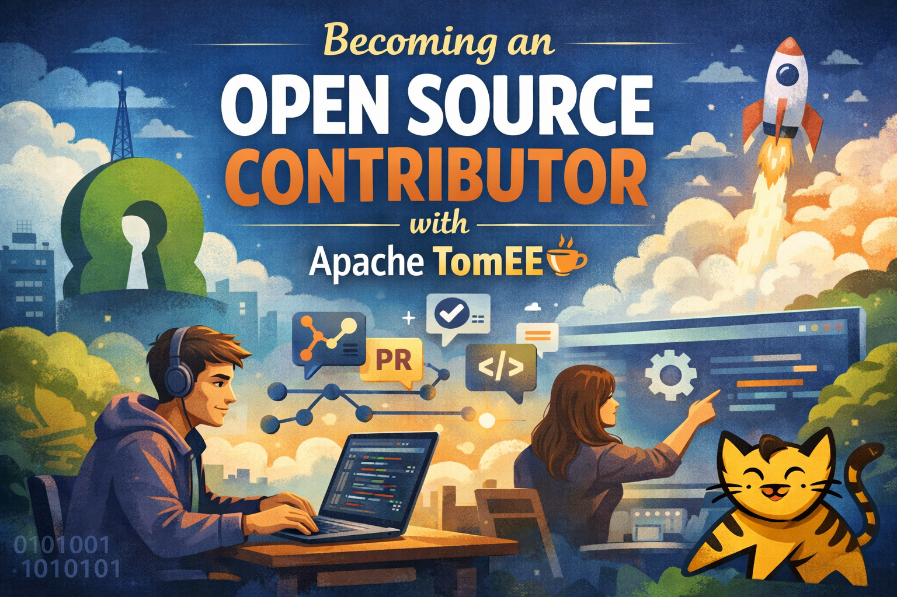
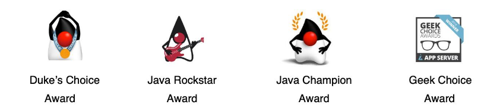
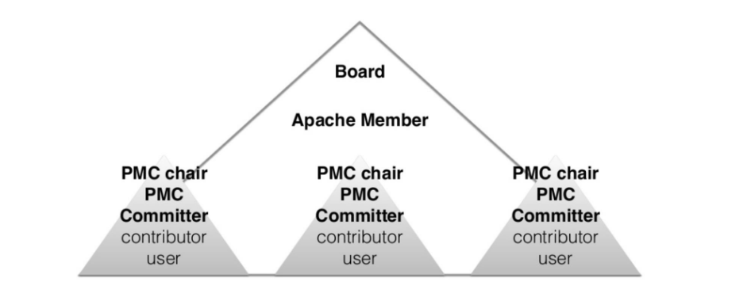
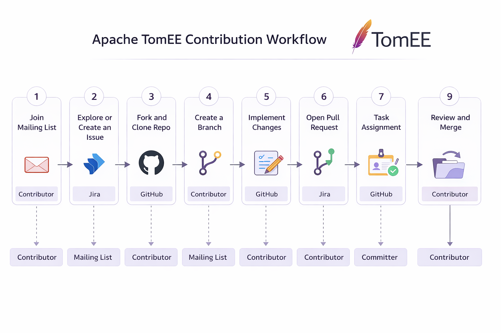
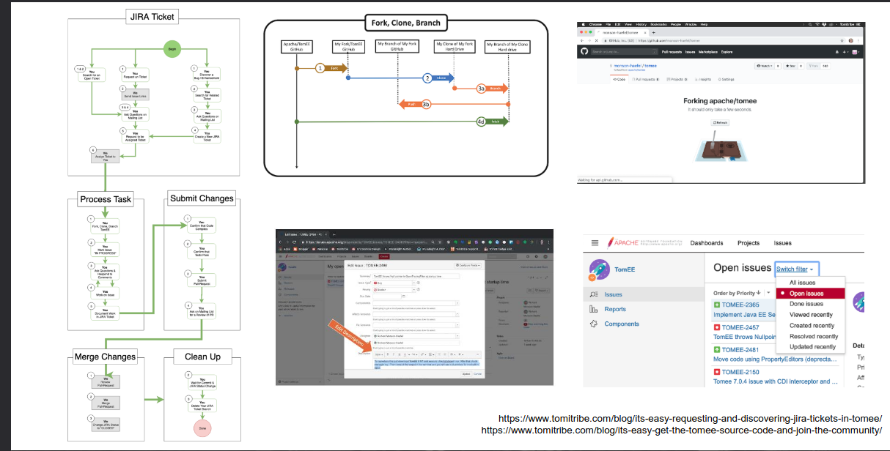

Contributing to open source is an important step for developers who want to grow their skills and engage with real world projects. In this post, you will learn how to become an open source contributor with **Apache TomEE**, a lightweight and Jakarta EE compliant application server built on top of Apache Tomcat.

We will explore why open source contribution matters, how the Apache Software Foundation community works, and the different ways you can contribute to the TomEE project. This guide is designed for Java and Jakarta EE developers who want a clear and practical starting point for contributing to open source software using Apache TomEE.

<!-- truncate -->

---

## What is Apache TomEE?

Apache TomEE is an open source, lightweight, and Jakarta EE compliant application server built on top of Apache Tomcat. It extends Tomcat by adding enterprise features such as dependency injection, JPA, JTA, JMS, security, and web services, while keeping the simplicity and performance Tomcat is known for.

TomEE is designed to provide a fully certified Jakarta EE runtime without the complexity of traditional full application servers. It is suitable for microservices, cloud native applications, and traditional enterprise systems. As an Apache Software Foundation project, TomEE follows an open governance model, is developed collaboratively by the community, and encourages contributions from developers of all experience levels.

 - Apache Tomcat version certified for Jakarta EE
 - [Jakarta EE 11 in progress](https://github.com/apache/tomee/tree/main)
 - Built with Apache components
 - Footprint: 30MB zip, 100~MB memory
 - awarded multiple times 
 

### Why Contribute to Apache TomEE?

Contributing to Apache TomEE is an opportunity to work with real world open source software while deepening your knowledge of Jakarta EE and enterprise Java standards. By contributing, you gain hands on experience with a production ready application server used by developers and organizations around the world.

Open source contribution also allows you to collaborate with experienced engineers, learn the Apache governance and development process, and improve both your technical and communication skills. Contributions to TomEE can take many forms, including code changes, documentation improvements, testing, bug reports, and community support. Every contribution helps strengthen the project and supports the long term evolution of Apache TomEE.

---

## The Apache Way

The Apache Way is the set of principles and values that guide how Apache Software Foundation projects are developed and governed. It emphasizes community driven development, open collaboration, and transparent decision making. In Apache projects, the community is more important than the code, and decisions are made through discussion and consensus rather than authority.

Contributions are evaluated based on their technical merit, not on who submits them. This meritocratic approach encourages learning, respect, and long term participation. Communication happens in public channels such as mailing lists, ensuring that discussions and decisions remain open and archived. By following the Apache Way, projects like Apache TomEE foster a healthy, inclusive, and sustainable open source ecosystem where contributors at all levels are welcome.

### Roles and Functions in the Apache Way

The Apache Way defines a clear but flexible governance structure based on merit and community trust. The roles shown in the diagram represent different levels of responsibility within an Apache project.

- **User**: Users are people who use the software. They may report bugs, request features, ask questions, or provide feedback. Many contributors start as users.

- **Contributor**: Contributors actively help the project but do not have direct commit access. They submit patches, pull requests, documentation updates, tests, or bug reports. Contributions are reviewed by committers and PMC members.

- **Committer**: Committers are trusted contributors who have been granted write access to the project repository. They can commit code directly, review contributions, and help maintain project quality. Committer status is earned through consistent and valuable contributions.

- **PMC (Project Management Committee)**: The PMC is responsible for the overall health and direction of the project. PMC members oversee releases, ensure compliance with Apache policies, manage project decisions, and mentor contributors and committers. They also vote on new committers.

- **PMC Chair**: The PMC Chair acts as the main liaison between the project and the Apache Software Foundation Board. This role is administrative rather than authoritative and ensures that the project reports regularly to the ASF Board.

- **Apache Member**: Apache Members are individuals recognized by the Apache Software Foundation for significant and sustained contributions across one or more Apache projects. Membership is at the foundation level, not limited to a single project.

- **ASF Board**: The Apache Software Foundation Board provides legal and organizational oversight for all Apache projects. The Board does not manage day to day development but ensures that projects follow the Apache Way and operate in a sustainable and transparent manner.

---

## Tools Used in the Apache TomEE Community

- **Mailing Lists**: Mailing lists are the primary and official communication channel in Apache projects. Important discussions, design decisions, votes, and announcements happen publicly on these lists. They ensure transparency and preserve the project’s history, which is a core principle of the Apache Way.

- **Jira**: Jira is used to track bugs, improvements, tasks, and feature requests. Each issue contains technical details, discussions, and progress updates. New contributors often start by picking small or beginner friendly issues from the Jira board.

- **Release Process**: The release process defines how new versions of Apache TomEE are prepared, reviewed, and published. It includes code freezes, testing, voting by the PMC, and final approval. This process ensures quality, stability, and compliance with Apache Software Foundation policies.

- **Slack**: Slack is used for more informal and real time communication within the Apache community. It is helpful for quick questions, guidance, and community interaction. While Slack is useful for collaboration, official decisions are always made on mailing lists.

- **Git Pull Requests**: Git pull requests are used to propose changes to the codebase or documentation. Contributors submit PRs, which are reviewed by committers and PMC members. Feedback and discussion happen directly in the PR before changes are merged.

### Community Resources
 - Apache TomEE Community Page: [tomee.apache.org/community](https://tomee.apache.org/community/index.html)
 - Apache Software Foundation Slack: https://the-asf.slack.com/
 - Jira: https://issues.apache.org/jira/browse/TOMEE
 - Mailing Lists: https://lists.apache.org/list.html?dev@tomee.apache.org

---

## Technical Prerequisites for Contributing

- **Java SE(version 17+**): Java SE is the core platform used to develop and run Apache TomEE. A solid understanding of the Java language, the JVM, and standard APIs is essential for reading the codebase, debugging issues, and implementing fixes.

- **Maven**: Apache Maven is the build and dependency management tool used by the TomEE project. Contributors use Maven to build the project locally, run tests, manage modules, and verify changes before submitting contributions.

- **Git**: Git is the version control system used to manage the source code. Contributors must know how to clone repositories, create branches, commit changes, and submit pull requests following the project’s workflow.

- **Jakarta EE (Java EE)**: Jakarta EE provides the enterprise specifications implemented by Apache TomEE, such as CDI, JPA, JTA, JMS, and web services. Understanding these APIs helps contributors work on features, bug fixes, and compliance with Jakarta EE standards.

- **JUnit**: JUnit is the primary testing framework used for unit testing in Apache TomEE. Contributors write and maintain JUnit tests to validate functionality, prevent regressions, and ensure code quality.

- **Arquillian**: Arquillian is used for integration and container based testing. It allows tests to be executed inside or against a real TomEE runtime, making it easier to verify behavior in a production like environment.

Depending on the area of contribution, additional tools and technologies may be required, such as Docker, logging frameworks, CI tools, or other testing libraries. These can be learned gradually as you become more involved in the project.

---

## Types of Contributions

- **Documentation**: Improving documentation helps users and contributors understand how Apache TomEE works. This includes fixing typos, updating guides, writing tutorials, translating documentation and examples into other languages, and keeping all content aligned with new releases and features.

- **Website**: Website contributions involve improving content, layout, navigation, and accessibility of the Apache TomEE website. This can include updating pages, fixing broken links, improving SEO, or enhancing the user experience.

- **Tests**: Writing and maintaining tests helps ensure the stability and reliability of the project. Contributors can add unit tests, integration tests, or regression tests to validate functionality and prevent future issues.

- **Examples**: Examples provide practical demonstrations of how to use Apache TomEE features and Jakarta EE APIs. These can include sample applications, configuration examples, or code snippets that help users learn faster.

- **Increasing Test Coverage**: Improving test coverage means adding more unit, integration, and performance tests. Higher coverage increases confidence in changes, improves code quality, and reduces the risk of regressions.

- **New Features**: Contributors can propose and implement new features that add value to Apache TomEE. These contributions usually involve discussion with the community, design proposals, and careful alignment with Jakarta EE specifications and project goals.

- **Updating Libraries**: Keeping dependencies up to date helps maintain security, compatibility, and performance. This includes upgrading third party libraries and ensuring changes do not introduce regressions.

- **Workshops**: Workshops and educational content help spread knowledge about Apache TomEE. Contributors can organize talks, create tutorials, record demos, or run hands on sessions to grow the community and onboard new contributors.

---

## Apache TomEE Contribution Workflow

 1. **Join the Mailing List** - The contributor subscribes to the dev-subscribe@tomee.apache.org mailing list. 
  
 A confirmation email is sent and must be replied to in order to complete the subscription. Once confirmed, the contributor becomes part of the public developer communication channel.

 2. **Explore or Create an Issue** - The contributor searches for an existing issue or creates a new one in Apache Jira.

Jira sends notifications about the issue to the mailing list, keeping the community informed.

3. **Fork and Clone the Repository** - The contributor forks the [Apache TomEE](https://github.com/apache/tomee) repository on GitHub and clones it locally.

4. **Create a Branch** - A new branch is created for the specific task or issue being worked on.

5. **Implement the Changes** - The contributor makes the required code or documentation changes.
Changes are committed locally and pushed to the forked repository.

6. **Open a Pull Request** - A Pull Request is opened on GitHub.
 
 The contributor informs the community about the PR by referencing it in the Jira ticket and, when appropriate, on the mailing list.

 7. **Task Assignment** - A committer or PMC member assigns the Jira issue to the contributor, formalizing ownership of the task.

 8. **Review Process** - Committers review the Pull Request, provide feedback, and request changes if needed. the contributor updates the PR based on the review comments.

 9. **Merge the Pull Request** - Once approved, a committer merges the Pull Request into the main branch.

 10. **Update the Issue Status** - The Jira ticket is updated to reflect the completed work and merged changes.

 11. **Sync with Main Branch** - The contributor rebases or updates their local branch with the latest changes from the main branch.

 
 
### Demonstration in Video

The demonstration presented in this section is based on a video recorded in 2019, which shows a practical example of contributing to Apache TomEE. Although the video is not recent, it remains relevant because it demonstrates the core contribution workflow, tools, and practices used in Apache projects. 

The fundamental concepts shown in the video, such as issue tracking, code contribution, and community interaction, are still valid today and help illustrate how the Apache Way works in practice.

Video reference(Spanish): <iframe width="680" height="382" src="https://www.youtube.com/embed/3XZjdiVGVbM" title="Conviértete en un Contributor de Open Source con Apache TomEE by  Cesar Hernandez y Daniel Dias [ES]" frameborder="0" allow="accelerometer; autoplay; clipboard-write; encrypted-media; gyroscope; picture-in-picture; web-share" referrerpolicy="strict-origin-when-cross-origin" allowfullscreen></iframe>

---

## Final Thoughts

Becoming an open source contributor is a journey built on learning, collaboration, and continuous improvement. Contributing to Apache TomEE allows you to work with real world enterprise technology while being part of a transparent, merit based, and community driven ecosystem.

Every contribution matters, whether it is documentation, testing, examples, or code. By participating in the Apache community and following the Apache Way, you not only help improve the project but also grow as a developer and collaborator. Start small, stay engaged, and enjoy the process of building open source software together.

---

## References

- [Apache TomEE Official Website](https://tomee.apache.org/)
- [Apache TomEE Community and Contribution Guide](https://tomee.apache.org/community/)
- [Apache Software Foundation](https://www.apache.org/)
- [The Apache Way](https://www.apache.org/theapacheway/)
- [Apache TomEE Source Code Repository](https://github.com/apache/tomee)
- [Apache Jira](https://issues.apache.org/jira/)
- [Apache Software Foundation Slack](https://the-asf.slack.com/)
- [Presentation: Becoming an Open Source Contributor with Apache TomEE-pt-br](https://speakerdeck.com/danieldiasjava/tornando-se-um-contribuidor-open-source-com-apache-tomee)
- [Video Demonstration (2019): Apache TomEE Contribution Workflow](https://www.youtube.com/live/3XZjdiVGVbM)

