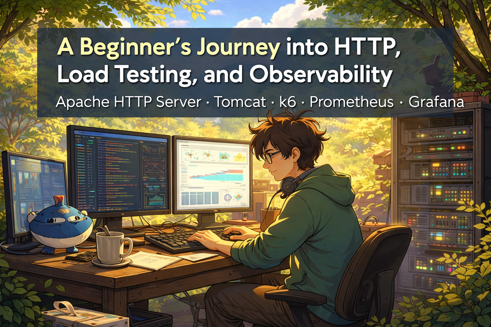
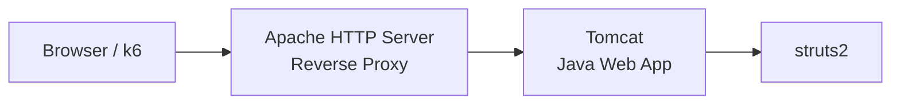
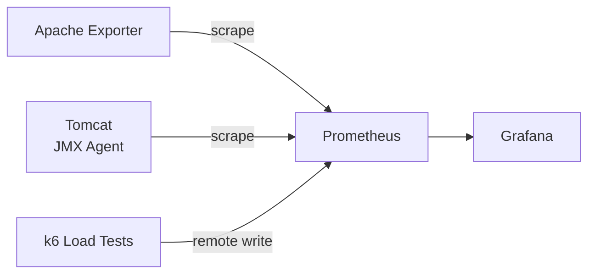
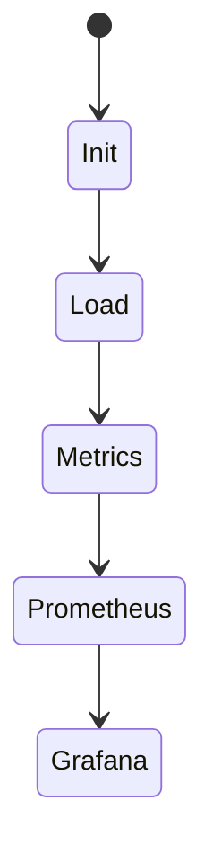

import useBaseUrl from '@docusaurus/useBaseUrl';


>:::warning 
> Everything in this post was built purely for **curiosity, learning, and research purposes**.  
> I’m not a networking or infrastructure expert. The environment was intentionally simple and exploratory.  
> **AI was used as a learning and research assistant**, helping to speed up understanding and experimentation.
---

## Introduction

I’m not a networking or infrastructure expert. This experiment started from a very simple  and honest question:

**How does HTTP really work in practice when requests hit a server, pass through a reverse proxy, are stressed by load tests, and are explained through metrics?**

This work was driven by **curiosity and hands-on learning**. There was no production goal, no attempt at performance optimization, and no claim of best practices. The goal was to understand behavior by building, breaking, measuring, and observing.

To answer that question, I built a **small but realistic local environment** using common tools. The focus was:

- Understanding HTTP request flow
- Learning how reverse proxies behave
- Generating realistic load
- Observing system behavior via metrics

<!-- truncate -->
---

## High-Level Architecture

### Request Flow



### Metrics Flow



---

## Docker Compose Environment

Everything runs locally using Docker Compose.

<details>
  <summary>docker-compose.yaml</summary>
```yaml
version: "3.9"

services:
  tomcat:
    image: tomcat:11-jre17
    container_name: tomcat
    ports:
     - "9010:9010"
     # - "8080:8080"   # opcional (debug)
    volumes:
      - ./tomcat/war:/usr/local/tomcat/webapps
      - ./tomcat/jmx:/jmx
      - ./tomcat/setenv.sh:/usr/local/tomcat/bin/setenv.sh
    networks:
      - app-net

  apache:
    image: httpd:2.4.66
    container_name: apache
    ports:
      - "80:80"
    volumes:
      - ./apache/httpd.conf:/usr/local/apache2/conf/httpd.conf
    depends_on:
      - tomcat
    networks:
      - app-net

  apache-exporter:
    image: lusotycoon/apache-exporter
    container_name: apache-exporter
    command:
      - '--scrape_uri=http://apache/server-status?auto'
    ports:
      - "9117:9117"
    depends_on:
      - apache
    networkvss:
      - app-net

  prometheus:
   image: prom/prometheus
   container_name: prometheus
   command:
    - '--config.file=/etc/prometheus/prometheus.yml'
    - '--web.enable-remote-write-receiver'
   volumes:
     - ./pro/prometheus.yml:/etc/prometheus/prometheus.yml
   ports:
     - "9090:9090"
   networks:
     - app-net

  grafana:
   image: grafana/grafana
   container_name: grafana
   ports:
     - "3000:3000"
   networks:
     - app-net

networks:
  app-net:

```
</details>
---

## Apache HTTP Server Configuration

Apache acts as the **single entry point** and reverse proxy.

<details>
  <summary>httpd.conf</summary>

```properties
ServerName localhost
Listen 80

# ===== MPM (OBRIGATÓRIO) =====
LoadModule mpm_event_module modules/mod_mpm_event.so

# ===== MÓDULOS BÁSICOS =====
LoadModule authn_core_module modules/mod_authn_core.so
LoadModule authz_core_module modules/mod_authz_core.so
LoadModule unixd_module modules/mod_unixd.so
LoadModule dir_module modules/mod_dir.so
LoadModule mime_module modules/mod_mime.so
LoadModule log_config_module modules/mod_log_config.so

# ===== PROXY =====
LoadModule proxy_module modules/mod_proxy.so
LoadModule proxy_http_module modules/mod_proxy_http.so
LoadModule headers_module modules/mod_headers.so

# ===== STATUS =====
LoadModule status_module modules/mod_status.so
ExtendedStatus On

<Location /server-status>
    SetHandler server-status
    Require all granted
</Location>

# ===== LOGS (Docker-friendly) =====
ErrorLog /proc/self/fd/2
CustomLog /proc/self/fd/1 combined

LogFormat "[STRUTS2] %h %l %u %t \"%r\" %>s %b" struts_format

<VirtualHost *:80>
    ServerName localhost

    CustomLog /proc/self/fd/1 struts_format

    ProxyPreserveHost On

    ProxyPass /server-status !

    ProxyPass / http://tomcat:8080/
    ProxyPassReverse / http://tomcat:8080/
</VirtualHost>

```
</details>

Key takeaways:

- Apache has no UI — configuration is everything
- `/` in `ProxyPass` means "forward everything"
- `mod_status` enables observability

---

## Tomcat and Metrics

Tomcat runs a very simple web application, deployed from the `tomcat/war` directory.

Metrics are exposed using the **Prometheus JMX Java Agent**, which is attached directly to Tomcat via `CATALINA_OPTS`. This configuration is defined in the `tomcat/setenv.sh` file, where the agent path points to the `jmx` directory.

Inside the `jmx` folder there is a configuration file named **`tomcat-jmx.yaml`**, which defines which MBeans and metrics should be exposed by the JMX agent (for example, JVM memory, threads, and Tomcat-specific metrics).

This approach keeps the setup simple, avoids running an additional exporter container, and is closer to how many real-world Java applications are instrumented for observability.

---


## Prometheus Configuration

Prometheus acts as the central component of observability in this setup. It is responsible for collecting (scraping) metrics from all running services and also for receiving metrics pushed by k6 during load tests.

In this environment, Prometheus plays two distinct roles:

1. **Pull-based collection (scraping):**  
   - Prometheus periodically scrapes metrics from:
     - **Apache Exporter**, which exposes metrics from the Apache HTTP Server via `/server-status?auto`
     - **Tomcat**, which exposes JVM and application metrics through the Prometheus JMX Java Agent attached to Tomcat

2. **Push-based ingestion (Remote Write):**  
   - Unlike the other services, **k6 does not get scraped by Prometheus**.  
   - Instead, k6 sends its metrics directly to Prometheus using the **Remote Write API** during test execution.  
   - For this to work, Prometheus must be started with the remote write receiver enabled.

This hybrid model (scrape + remote write) is very common in real-world observability setups, especially when dealing with short-lived processes such as load tests.

### Key configuration aspects

In `prometheus.yml`, the important points are:

- Enabling the remote write receiver so k6 can send metrics: `--web.enable-remote-write-receiver` declared in docker-compose.

Defining scrape jobs for the services that expose metrics:

<details>
  <summary>httpd.conf</summary>
```yaml
scrape_configs:
  - job_name: "apache"
    static_configs:
      - targets: ["apache-exporter:9117"]

  - job_name: "tomcat"
    static_configs:
      - targets: ["tomcat:9010"]
```

</details>

:::note
k6 does not require a scrape config. It pushes metrics via **Remote Write**.
:::

---

## Load Testing with k6

Load testing was performed using **k6**, simulating real traffic with a
**constant arrival rate (TPS-based)** scenario rather than a simple
virtual user (VU) ramp-up. This choice helped model a more realistic and
controlled workload.

The k6 test lives inside the `k6-script/` directory, in a file named
`test.js`.

### Test flow



### k6 Test Script (`k6-script/test.js`)

The script randomly selects one of three endpoints on each iteration,
sends an HTTP GET request, and validates that the response returns HTTP
200.

<details>
  <summary>test.js</summary>

``` js
import http from 'k6/http';
import { check } from 'k6';

const endpoints = [
    '/struts2/',
    '/struts2/index',
    '/struts2/hello'
];

function randomEndpoint() {
    return endpoints[Math.floor(Math.random() * endpoints.length)];
}

export let options = {
    scenarios: {
        high_tps: {
            executor: 'constant-arrival-rate',
            rate: 1000,           // Target TPS
            timeUnit: '1s',
            duration: '60m',
            preAllocatedVUs: 500, // Initial VUs
            maxVUs: 1500,         // Maximum VUs
        },
    },
    thresholds: {
        'http_req_duration': ['p(95)<200'],
        'http_req_failed': ['rate<0.01'],
    },
};

export default function () {
    let url = `http://localhost:80${randomEndpoint()}`;
    let res = http.get(url);
    check(res, { 'status 200': (r) => r.status === 200 });
}
```
</details>

### How the test is executed (Docker)

The test is executed using the official `grafana/k6` image, with metrics
sent to Prometheus via **Remote Write**:

``` bash
docker run --rm --network host -e K6_PROMETHEUS_RW_SERVER_URL=http://localhost:9090/api/v1/write -v /path/to/k6-script:/scripts  grafana/k6:latest run -o experimental-prometheus-rw /scripts/test.js
```

This approach means:

-   k6 **does not need to be scraped** by Prometheus.
-   k6 **pushes metrics directly** to Prometheus using Remote Write.
-   Prometheus must be configured to accept remote writes.

### What I learned from this setup

-   **High TPS without enough capacity leads to dropped iterations.**
-   **Load testing without observability is blind.**
-   **Latency patterns often explain failures faster than logs.**
-   Realistic load scenarios require careful tuning of VUs, rate, and
    duration.

---

## Grafana: Visualizing the System

After starting the full environment via **docker-compose**, Grafana will be available at: `http://localhost:3000`


### Creating the Prometheus Data Source

Before importing any dashboard, you **must configure Prometheus as a Data Source in Grafana**:

1. Open Grafana in your browser: `http://localhost:3000`
2. In the left menu, go to **Connections → Data Sources**
3. Click **Add data source**
4. Select **Prometheus**
5. In the **URL** field, enter: `http://prometheus:9090/`

6. Click **Save & Test**  
   - You should see a message confirming that the connection was successful.

:::warning
Without this step, the dashboards will not work because Grafana will not know where to fetch the metrics from.
:::

---

### Importing the Dashboards

With Prometheus configured as a Data Source, go to:

**Dashboards → New → Import**

And use the IDs below.

#### Apache HTTP Server (Reverse Proxy)
- **ID:** `3894`
- **Link:** https://grafana.com/grafana/dashboards/20465-apache-http-server/

This dashboard allows you to monitor:
- Requests per second (RPS)
- Response time
- Active connections
- Apache status via `/server-status`

This was essential to understand how Apache behaved as the **entry point of the system** under load.

---

#### k6 (Load Testing)
- **ID:** `19665`
- **Link:** https://grafana.com/grafana/dashboards/19665-k6-prometheus/

With this dashboard, you can visualize:
- TPS generated by k6
- Latency (p50, p90, p95)
- Error rate
- Dropped iterations
- Number of active VUs

This panel was fundamental to correlate **the load generated by k6** with the behavior of Apache and Tomcat.

---

#### Apache Tomcat (Java Application)
- **Link:** https://grafana.com/grafana/dashboards/19532-apache-tomcat/

This dashboard displays metrics exposed by the **Tomcat JMX Agent**, such as:
- JVM memory usage
- CPU usage
- Number of active threads
- Request processing time
- Connection pool status

This helped identify whether the bottleneck was in the application (Tomcat/JVM) or in the proxy (Apache).

---

### How Everything Connects in Grafana

At a high level, the observability flow looks like this:

- **k6** → sends metrics to **Prometheus (Remote Write)**
- **Apache Exporter** → scraped by **Prometheus**
- **Tomcat (JMX Agent)** → scraped by **Prometheus**
- **Grafana** → queries **Prometheus** and displays everything in dashboards

In practice, this allowed us to:
- See in real time when the system started to struggle
- Identify whether the issue was in Apache, Tomcat, or the load test itself
- Correlate TPS peaks with increased latency and errors

---

## What You Don’t Need to Understand Yet

If you’re just starting out, it’s completely fine if some parts feel confusing. This experiment was designed to build **intuition first**, not mastery.

At this stage, you **don’t need to fully understand**:

- Every Apache directive or module
- Every Prometheus metric name
- JVM internals or thread pool tuning
- How exporters work internally

The goal is simply to recognize **how the pieces connect**. The details will naturally make more sense over time.

---

## Key Learnings

- HTTP is simple in theory, complex in practice
- Reverse proxies are powerful but unforgiving
- Observability turns failures into explanations
- Small systems are perfect learning labs

---

## Service Endpoints

| Service | Description | Endpoint |
|--------|-------------|----------|
| **Apache HTTP Server** | Entry reverse proxy | `http://localhost/` |
| **Apache Server Status** | Native Apache metrics | `http://localhost/server-status?auto` |
| **Tomcat (App)** | Struts application root | `http://localhost/struts2/` |
| **Tomcat (App)** | Index page | `http://localhost/struts2/index` |
| **Tomcat (App)** | Hello endpoint | `http://localhost/struts2/hello` |
| **Prometheus** | Web UI and queries | `http://localhost:9090` |
| **Prometheus Remote Write (k6)** | Receives k6 metrics | `http://localhost:9090/api/v1/write` |
| **Grafana** | Dashboards and visualization | `http://localhost:3000` |
| **Apache Exporter** | Exposes Apache metrics | `http://localhost:9117/metrics` |
| **Tomcat JMX Exporter** | JVM/Tomcat metrics | `http://localhost:9010/metrics` |

---

## Demo Video

Below is a short demonstration of the environment running, showing how requests flow through Apache, reach Tomcat, and how metrics appear in Grafana during the k6 load test.

<video controls width="100%">
  <source src={useBaseUrl('/videos/demo.webm')} type="video/webm" />
</video>

---

## Final Thoughts

This was never about building a production-grade system.

It was about **understanding how HTTP-based systems behave under pressure**, using tools that are commonly found in real-world environments. Through hands-on experimentation with Apache, Tomcat, k6, Prometheus, and Grafana, I was able to see in practice how requests flow, where bottlenecks emerge, and how observability helps make sense of it all.

If you’re learning about HTTP, infrastructure, or observability, my main suggestion is: **build something small, stress it, observe it, and don’t be afraid to break it.** That’s where real understanding begins.

If you’d like to explore or reproduce everything described in this post, all the code, configurations, and scripts are available here:

👉 **https://github.com/Daniel-Dos/beginners-http-load-testing-observability**

Feel free to run it locally, experiment, and adapt it to your own learning journey.
---

## References

- Apache HTTP Server
  - Apache HTTP Server Documentation — https://httpd.apache.org/docs/2.4/
  - mod_proxy (Reverse Proxy) — https://httpd.apache.org/docs/2.4/mod/mod_proxy.html  
  - mod_status — https://httpd.apache.org/docs/2.4/mod/mod_status.html  

- Apache Tomcat
  - Apache Tomcat Documentation — https://tomcat.apache.org/tomcat-11.0-doc/
  - Tomcat JMX Monitoring — https://tomcat.apache.org/tomcat-11.0-doc/monitoring.html  

- Prometheus & Observability
  - Prometheus Official Documentation — https://prometheus.io/docs/
  - Prometheus Remote Write — https://prometheus.io/docs/concepts/remote_write_spec/
  - Prometheus JMX Exporter — https://github.com/prometheus/jmx_exporter  

- Grafana
  - Grafana Documentation — https://grafana.com/docs/
  - Apache HTTP Server Dashboard — https://grafana.com/grafana/dashboards/20465-apache-http-server/
  - k6 Prometheus Dashboard — https://grafana.com/grafana/dashboards/19665-k6-prometheus/
  - Apache Tomcat Dashboard — https://grafana.com/grafana/dashboards/19532-apache-tomcat/

- k6 (Load Testing)
  - k6 Official Documentation — https://k6.io/docs/
  - k6 Prometheus Remote Write — https://k6.io/docs/results-output/real-time/prometheus-remote-write/

- Docker & Containerization
  - Docker Documentation — https://docs.docker.com/
  - Docker Compose Reference — https://docs.docker.com/compose/