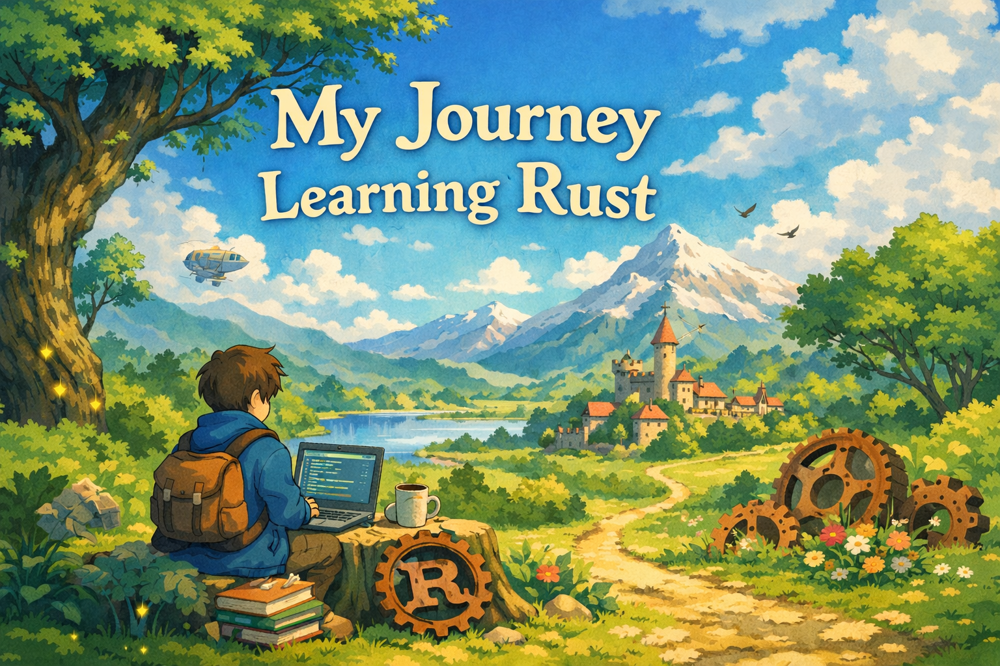
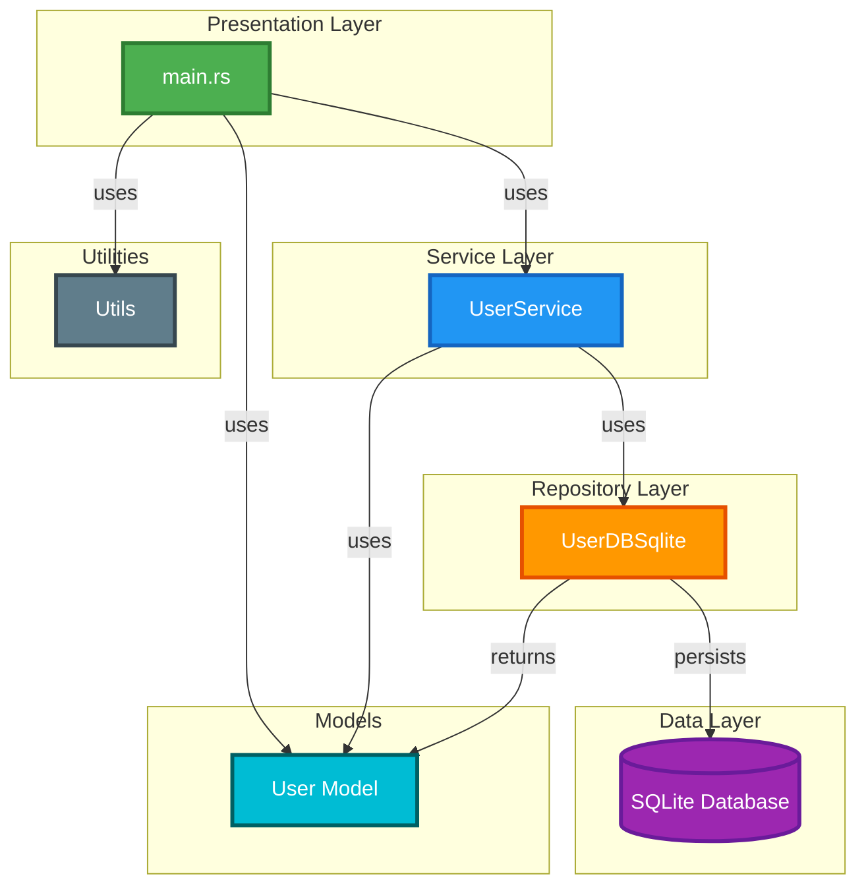

import useBaseUrl from '@docusaurus/useBaseUrl';

## Project: rust-learning - User CRUD with SQLite

Recently, I have been deepening my studies in Rust, and to solidify my learning I built a practical project: a complete User CRUD application using SQLite.

The project, available on GitHub, demonstrates how I applied core Rust concepts in a real-world backend scenario, including asynchronous programming, structured error handling, layered architecture (Service/Repository), and database integration with SQLx.

This hands-on implementation was essential to move beyond theory and translate Rust’s safety and performance principles into practical, production-style code.

Repository: 👉 https://github.com/Daniel-Dos/rust-learning

<!-- truncate -->

------------------------------------------------------------------------

## 🦀 Technologies Used

-   **Rust (edition 2024)**
-   **Tokio** (asynchronous runtime)
-   **SQLx** (asynchronous SQLite access)
-   **Tracing** (structured logging)
-   **Anyhow** (idiomatic error handling)
-   **Rand** (random data generation)

------------------------------------------------------------------------

## 🛠️ What I Implemented

The project consists of a complete User CRUD:

-   ✅ **Create** -- Insert users with random data\
-   📋 **Read** -- List all users\
-   ✏️ **Update** -- Update user email\
-   ❌ **Delete** -- Remove user by ID

------------------------------------------------------------------------

## 🏗️ Architecture Applied

I structured the project into layers to maintain clarity and separation
of responsibilities:

-   **Main / CLI** → Application entry point
-   **Service** → Business rules
-   **Repository** → Database access
-   **Models / Utils** → Entities and helper functions

This organization allowed me to apply concepts similar to modern backend
architectures.

------------------------------------------------------------------------

## 🧠 Key Learnings

### 🔐 Ownership and Borrowing

I learned in practice how Rust's ownership system works:

-   The difference between move and borrow
-   When and how values are dropped
-   How to avoid lifetime issues

This completely changed how I think about memory management.

------------------------------------------------------------------------

### ⚠️ Idiomatic Error Handling

I started using:

-   `Result` and the `?` operator
-   `map_err`
-   `ok_or_else`
-   Structured error propagation with `anyhow`

The code became cleaner, more expressive, and safer.

------------------------------------------------------------------------

### ⚡ Async/Await with Tokio

I implemented asynchronous database operations while understanding:

-   How `.await` impacts lifetimes
-   How to avoid invalid references
-   How to properly structure async calls

------------------------------------------------------------------------

### 🧩 Architecture with Traits and Dependency Injection

I used traits as abstractions to decouple layers and keep the code more
testable and organized.

------------------------------------------------------------------------

### 📊 Structured Logging

I learned the importance of:

-   Avoiding logs directly inside the repository layer
-   Keeping logs in upper layers (CLI or Service)
-   Separating infrastructure concerns from business logic

------------------------------------------------------------------------

## Demo Video

Below is a short demonstration of the environment running the implemented CRUD operations:

  <iframe
    src="https://drive.google.com/file/d/1DH9gxlzsCdJ-n_2onQ3wGYB0ZcWISF6t/preview"
    style={{
      position: "absolute",
      top: 0,
      left: 0,
      width: "100%",
      height: "100%",
      border: "none"
    }}
     allow="autoplay; fullscreen"
    allowFullScreen
  />

---

## 💡 Final Reflection

This project went far beyond a simple "hello world".

It challenged me to deeply understand:

-   Memory safety
-   Asynchronous flows
-   Architectural organization
-   Backend best practices in Rust

Rust has a challenging learning curve, but it is extremely rewarding.

And this is just the beginning 🚀

---

## 📚 References

- Rust Official Documentation — https://www.rust-lang.org/learn  
- The Rust Programming Language (The Book) — https://doc.rust-lang.org/book/  
- Tokio Documentation — https://docs.rs/tokio  
- SQLx Documentation — https://docs.rs/sqlx  
- Tracing Crate Documentation — https://docs.rs/tracing  
- Anyhow Crate Documentation — https://docs.rs/anyhow  
- Project Repository (rust-learning) — https://github.com/Daniel-Dos/rust-learning  

---
