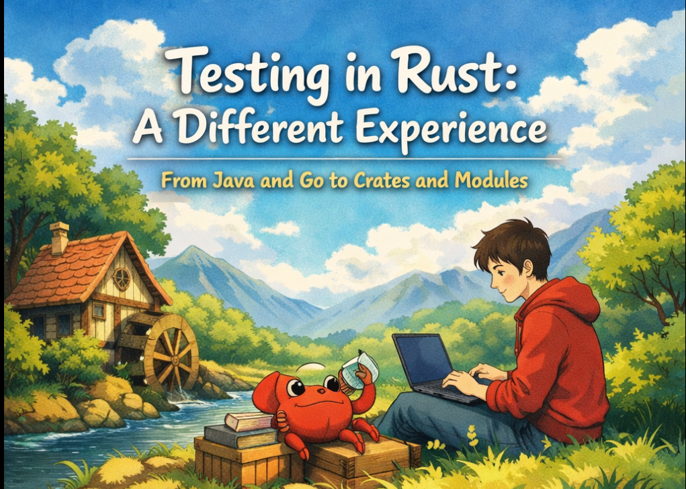

# Testing in Rust: Internal vs Integration Tests and What They Teach Us

## Introduction

When I started writing tests in Rust, it felt different from what I was
used to in Java and Go.

Not better. Not worse. Just different.

But that difference reveals something deeper about how Rust approaches
architecture and modularity.

<!-- truncate -->

------------------------------------------------------------------------

## Testing a Private Function

Let’s compare something simple: testing internal logic.

### Testing in Go
``` go showLineNumbers
package mathutil

func add(a, b int) int {
    return a + b
}
```

Test (same package):
``` go showLineNumbers
package mathutil

import "testing"

func TestAdd(t *testing.T) {
    if add(2, 3) != 5 {
        t.Fail()
    }
}
```

If the test is in the same package, it can access `add`, even though it's not exported.

If you move the test to:

``` go showLineNumbers
package mathutil_test
```
Then `add` becomes inaccessible.

Go visibility is package-based.

### Testing in Java
```java showLineNumbers
public class MathUtil {
    private int add(int a, int b) {
        return a + b;
    }
}
```

```java showLineNumbers
public class MathUtilTest {

    @Test
    void testAdd() {
        MathUtil util = new MathUtil();
        // util.add(2,3); ❌ Not accessible
    }
}
```

You cannot access `private` methods.

Common workarounds:
 -   Test only public methods
 - Change visibility to package-private
 - Use reflection

 Java enforces encapsulation at the class level.


### Testing in Rust

``` rust showLineNumbers
fn add(a: i32, b: i32) -> i32 {
    a + b
}

#[cfg(test)]
mod tests {
    use super::*;

    #[test]
    fn test_add() {
        assert_eq!(add(2, 3), 5);
    }
}
```

Why does this work?

Because the test module lives inside the same module scope.

Rust allows internal testing without exposing the function publicly.

This is a deliberate design choice.

------------------------------------------------------------------------

## Testing Public API 

Now let’s compare integration-style testing.

### Testing in Go - external-style test

``` go showLineNumbers
package mathutil_test

import (
    "testing"
    "myapp/mathutil"
)

func TestPublicAPI(t *testing.T) {
    result := mathutil.Add(2, 3)
    if result != 5 {
        t.Fail()
    }
}
```

This simulates real external usage.

### Testing in Java - external-style test

```java showLineNumbers
@Test
void testPublicMethod() {
    MathUtil util = new MathUtil();
    assertEquals(5, util.addPublic(2,3));
}
```

Tests always behave like external consumers.

### Rust (Integration Test)

Directory structure:
```
src/
 ├── lib.rs
tests/
 └── math_test.rs
```
lib.rs:
``` rust showLineNumbers
pub fn add(a: i32, b: i32) -> i32 {
    a + b
}
```

tests/math_test.rs:
``` rust showLineNumbers
use myapp::add;

#[test]
fn test_add() {
    assert_eq!(add(2, 3), 5);
}
```

Important detail:

Each file in `tests/` is compiled as a separate crate.
That means:
 - Only public items are accessible
 - The project must expose a lib crate

 This forces architectural clarity.

------------------------------------------------------------------------

## Structural Differences
- Go: Package-based visibility. Tests can be in the same package or a separate one.
```
mathutil/
 ├── math.go
 └── math_test.go
```
Simple and colocated.

- Java: Class-based visibility. Tests are usually in a separate test directory but can only access public or package-private members.
```
src/main/java/com/example/
src/test/java/com/example/
```
Separated by directory convention.

- Rust: Module and crate-based visibility. Internal tests can access private items, but integration tests must use the public API.
```
src/
 ├── lib.rs
 ├── module.rs
tests/
 └── integration_test.rs
```

Rust introduces a conceptual separation:
- Unit tests → inside modules
- Integration tests → separate crate boundary

This separation is semantic, not just folder-based.

------------------------------------------------------------------------
## Architectural Implications

In Go: 
 - Encapsulation is package-based.
 - Testing internal logic depends on package naming.

In Java:
 - Encapsulation is class-based.
 - You often test behavior, not implementation.

In Rust:
 Encapsulation is module-based.

 Rust encourages:
 - Testing internal implementation without exposing it
 - Testing public contracts from outside
 - Structuring projects around library crates

 Because integration tests require a `lib.rs`, many Rust projects naturally evolve into:
 ```
 src/
 ├── lib.rs   ← core logic
 └── main.rs  ← thin entrypoint
```

That separation improves:
    - Reusability
    - Testability
    - Architectural clarity

-------------------------------------------------------------------------

## What Rust Model Teaches
Rust makes you think in layers:
 - Internal correctness (unit tests)
 - Public guarantees (integration tests)

 Instead of exposing internals just to make tests work, Rust gives you controlled internal access.

 It protects your public API while keeping internal testing ergonomic.

## Conclusion

Rust testing approach may feel unusual at first, especially if you're
coming from Java or Go.

But once you understand the module and crate system, it makes
architectural sense.

Rust is not just about memory safety or performance.

It's about structure.

And testing is one of the places where that philosophy becomes very
clear.